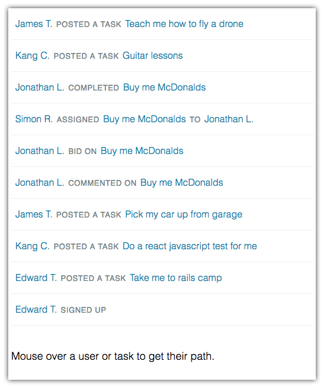
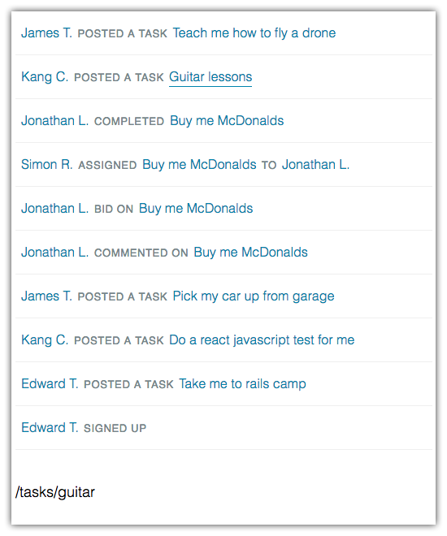
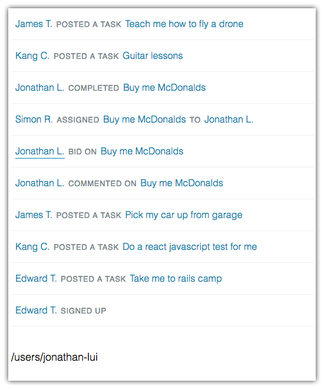

#Airtasker Front End Test

Thanks for your interest in Airtasker. As part of our hiring process Airtasker likes to ask candidates to complete a short exercise. It is designed to allow candidates to show off their coding skills and helps us assess a candidate's abilities.

Prerequisites of this task are an understanding of Javascript, Node, NPM and React.

The exercise should take between 2 and 4 hours to complete.

##Setup

To get started you will need to install the required dependencies:

	npm i

Then start webpack in watch mode:

	npm run dev

##Objective

Contained in this zip are the basics of an Airtasker activity feed application.

The objective is to complete the supplied React app so that it looks like the example PNGs. To do this you will have to

- create a [data parser](src/MyParser.js),
- modify the existing [React component](src/MyComponent.jsx) to render each item,
- add functionality so one can rollover user and task links to display their path
- and update the [stylesheet](src/MyStyle.css) to suit.

##Rules and Limitations

###Do:

Create a parser in [MyParser.js](src/MyParser.js) that parses the supplied [activity_feed.json](src/activity_feed.json). This is where you should generate the relevant path.

Create a React component in [MyComponent.jsx](src/MyComponent.jsx) to render a screen like [example.png](example.png), [example-over-task.png](example-over-task.png) and [example-over-user.png](example-over-user.png).

Modify styles in [MyStyle.css](src/MyStyle.css) to suit.

###Don't:

Don't modify `activity_feed.json`, `index.html` or `app.jsx`

##Criteria

###Required

The primary goal is well thought out, clean and testable code.

Your submission only needs to work in latest Chrome.

The objective must be completed, and the rules and limitations must be adhered to.

###Highly desired:

Writing tests, using a suite of your choice.

Pixel perfect output.

##Notes

We encourage you to ask any questions about the exercise.

There are no other restrictions.

You can structure your solution however you like.

You are welcome to use any node modules or third party libraries you see fit.

To complete the exercise please zip up your solution and email it back to us so we can review your submission.

Best of luck ;)
